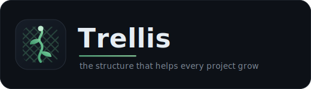

<p align="center">
  
</p>

<p align="center">
  <strong>Shared AI-agent conventions for rogueoak projects - installable into any repo, updatable in one command.</strong>
</p>

<p align="center">
  <a href="#quick-start"></a>
  <a href="#quick-start"></a>
  <a href="#quick-start"></a>
  <a href="#quick-start"></a>
  <a href="LICENSE"></a>
  <a href="https://github.com/rogueoak/trellis/releases/latest"></a>
</p>

Every rogueoak repo should feel like it was built by the same hand. Trellis is how. It is a
small, opinionated set of rules for the AI agents that work on rogueoak projects - how to write,
how to ship - plus the shared templates that go with them.

Install it once and your agents read from the same playbook as every other repo. When the
playbook changes, pull the update in one command. The rules live in version control, in plain
Markdown, so you can read every one in a sitting.

## What's new

<!-- whats-new -->
**0.2.0** - Install and update now bring your repo into compliance, not just carry the rules.
<!-- /whats-new -->

See every release at
**[github.com/rogueoak/trellis/releases/latest](https://github.com/rogueoak/trellis/releases/latest)**.
The line above is rewritten from the first line of your release notes each time a release is
published - no manual edits here.

## Quick start

Install through your agent's native plugin system, then run `/trellis-install` in the repo you
want to adopt it.

**Claude Code**
```text
/plugin marketplace add rogueoak/trellis
/plugin install trellis@trellis
/reload-plugins
/trellis-install
```
`/reload-plugins` makes the newly installed commands (`/trellis-install`, `/trellis-update`)
available in your current session.

**OpenAI Codex**
```text
codex plugin marketplace add rogueoak/trellis
```
Then install the **trellis** plugin from that marketplace and run `/trellis-install`.

**Gemini CLI**
```text
gemini extensions install https://github.com/rogueoak/trellis
```
(or `gemini extensions link .` for local development), then run `/trellis-install`.

**Cursor**

Add the `rogueoak/trellis` marketplace (in-editor marketplace panel or `/add-plugin`), then run
`/trellis-install`.

`/trellis-install` copies the rules into `docs/rules/`, points your `AGENTS.md` at them, and runs
a compliance pass that reports any existing violations of the mechanically-checkable rules (today,
the em/en-dash ban) so the repo starts in compliance, not just carrying the rules. The pass only
reports - run `/trellis-install --fix` to rewrite them, then review the diff. Later, pull updates
with `/trellis-update`. On Codex, Gemini, and Cursor, if the agent does not resolve the plugin
path on its own, the skill asks you to `export TRELLIS_SRC=<plugin root>` first.

## Pairs with Spectra

Trellis is the conventions. [Spectra](https://github.com/rogueoak/spectra) is the process -
spec-driven development with review personas. They are separate tools that compose, and most
rogueoak repos want both.

They install the same way. Add Spectra's marketplace alongside Trellis's and install it too -
on Claude Code:

```text
/plugin marketplace add rogueoak/spectra
/plugin install spectra@spectra
/reload-plugins
/spectra-install
```

For Codex, Gemini, and Cursor, follow [Spectra's quick start](https://github.com/rogueoak/spectra#quick-start);
the steps mirror Trellis's above. The two stay independent - update each on its own with
`/trellis-update` and `/spectra-update`.

## The rules

Two to start. More will grow on the trellis over time.

| File | What it governs |
|---|---|
| `docs/rules/guidelines.md` | How agents write and ship: ASCII-only text; tests, lint, and build green before merge; every PR comment resolved before merge; Conventional Commit messages. |
| `docs/rules/language.md` | The voice for anything public-facing: warm, specific, terse, example-driven, no hype. |

## What lands in your repo

```
docs/
  rules/
    guidelines.md         how agents write and ship
    language.md           the voice for public-facing writing
    .trellis-owned        which rules Trellis manages (so updates stay clean)
AGENTS.md                 a small Trellis block points your agents at the rules
.git/hooks/commit-msg     checks your commit messages (copied in; not tracked)
```

The commit-msg hook is a dependency-free POSIX `sh` script - it checks Conventional Commit format
with nothing to install (no Node, no build step). If a `commit-msg` hook already exists, Trellis
keeps it as `commit-msg.local` and chains to it rather than replacing it. If Trellis has to create
`AGENTS.md` from scratch, it also points `CLAUDE.md` and `GEMINI.md` at it so every agent reads the
same file.

## Repo layout (this repo)

- **`trellis/`** - the shippable plugin: the install/update skills, the rules, the templates,
  and the host block. This is what gets installed into other repos.
- **`docs/rules/`** - Trellis dogfooding itself: this repo follows its own rules.
- **`docs/`** (`specs/`, `plans/`, `feedback/`, `overview/`) - this repo is built under
  [Spectra](https://github.com/rogueoak/spectra), so its own development leaves a paper trail.
- **`assets/`** - the logo used by this README.

## License

See [LICENSE](LICENSE).
